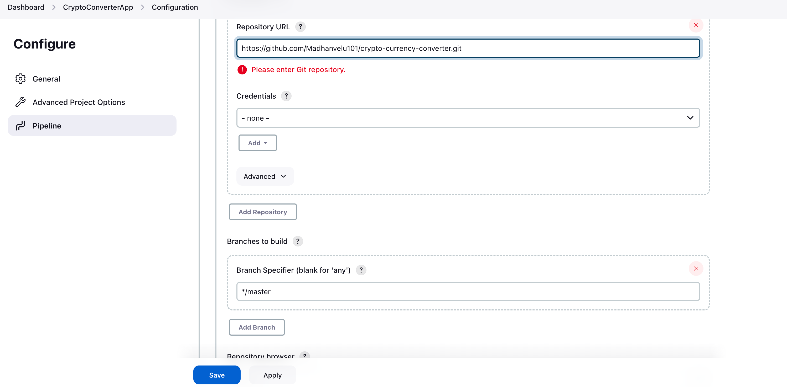

# crypto-currency-converter
This application will convert one unit of crypto currency to local currency price.

### Prerequisites
Before getting started, make sure you have the following tools installed:

* Java Development Kit (JDK) 8 or later
* Apache Maven
* Docker

### Build Project in local

Clone this repo in local.

Navigate the project repository. Ex: crypto-currency-converter

Run maven package command. This command creates a war file at /target

```mvn clean package```

### Deploy on tomcat

Upon running the above mentioned Maven command, it will generate '**crypto-converter.war**' file at **/target** location.

Deploy this war file using tomcat.


### Deploy on docker

Run this command to create docker image and deploy in local host.

```docker-compose up --build```

Now access http://localhost:8080/login to access the crypto-converter application.


## CICD Pipeline

CICD pipeline is setup on jenkins.

### Setting up Jenkins Pipeline for Crypto Spring Boot Application

### Prerequisites:
- Ensure you have Jenkins installed and running.
- Set up a version control repository (e.g., Git) to host your source code.

### Configure Jenkins:
1. Install the necessary plugins:
    - Open Jenkins, go to "Manage Jenkins" -> "Manage Plugins".
    - Install the following plugins:
        - Pipeline
        - Git
        - Maven

### Create a Jenkins pipeline job:
1. Create a new Jenkins job:
    - From the Jenkins dashboard, click on "New Item" to create a new job.
    - Provide a name for your pipeline job (e.g., "CryptoConverterApp") and select "Pipeline" as the job type.

2. Configure your pipeline:
    - Under the "Pipeline" section, select "Pipeline script from SCM" as the Definition.
    - Choose version control system (e.g., Git) and provide the repository URL.
    - Specify the branch or tag to build (e.g., */master).
    - Save your configuration.

### Trigger the Jenkins pipeline:
1. Open your Jenkins dashboard and navigate to your pipeline job ("CryptoConverterApp").
2. Click on "Build Now" to trigger the pipeline.




